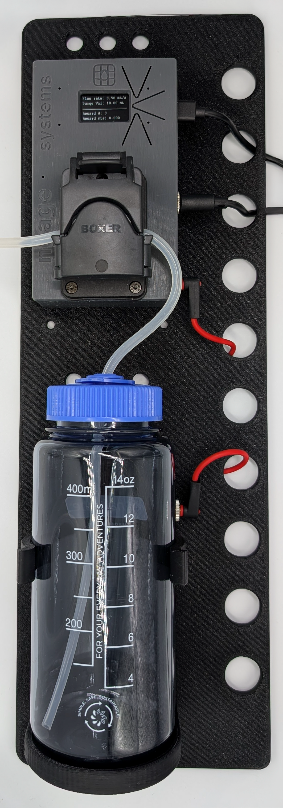
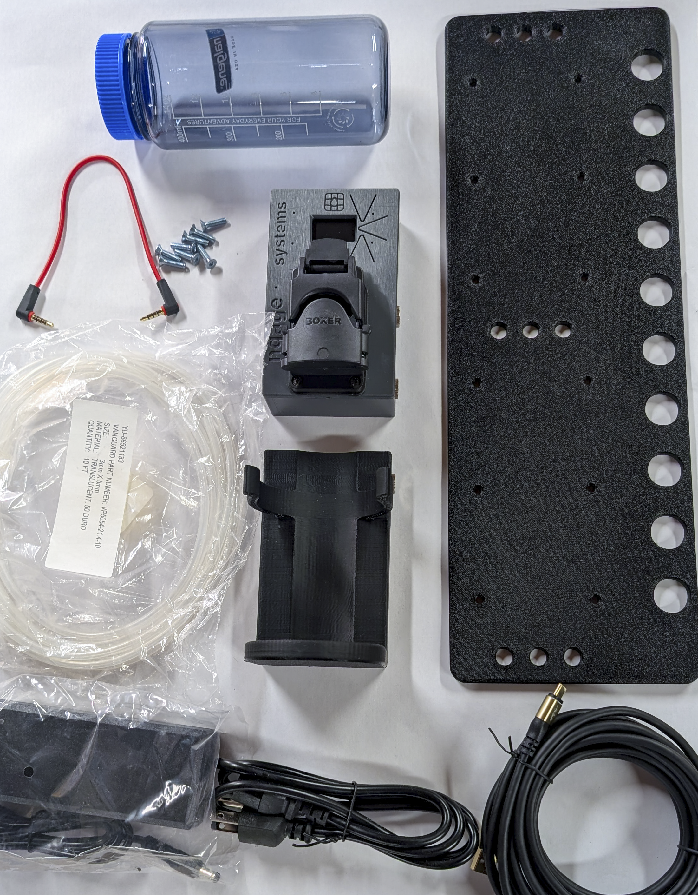
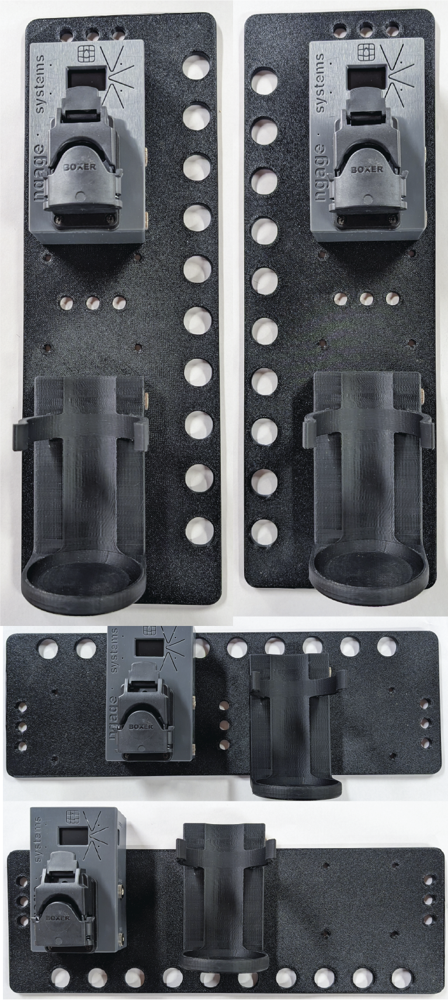
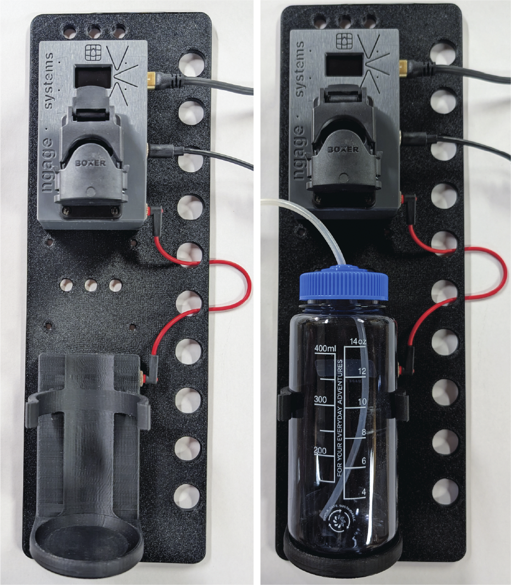
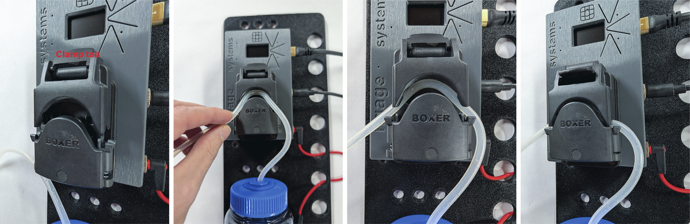

# Assembly guide (Juicer)

This is a first-draft assembly flow based on the photo set. If anything in your kit differs (pump model, fittings, mounting hardware, board revision), we can tweak the steps.

## Overview
- **Goal**: Mount the pump assembly + smart bottle holder, connect power/control wiring, then route tubing.

## Step 1 — Confirm the kit contents

- **Identify**: pump assembly, smart bottle holder, bottle, 24V power supply, USB cable, TRRS cable, tubing, mounting bracket, screws, screwdriver.

## Step 2 — Choose a mounting option and mechanically install

- **Pick an orientation**:
  - The bracket is designed with flexibility in mind, allowing mounting in several orientations.
  - Choose an orientation that best fits the intended space.
  - The smart bottle holder is designed to allow the plug to be installed on either the left or right side. Simply unscrew the back and move the connector to the side where it will be closest to the pump assembly.
- **Mount the pump assembly and smart bottle holder**:
  - Using the provided M4x16 screws and screwdriver, install the pump assembly with four screws.
  - Using the provided M4x16 screws and screwdriver, install the smart bottle holder with four screws.
- **Mount the bracket**:
  - The bracket is flexibly designed to be installed on a variety of hardware.
  - Mounting holes are spaced **195 mm** apart in the long dimension and **19.05 mm (0.75 in)** in the short dimension.
  - Using at least 2 screws (user supplied), mount the bracket/panel.

## Step 3 — Wiring

- Plug the **24 VDC power supply** into the pump assembly and wall power, using the routing holes in the mounting bracket to manage wires and reduce inadvertent removal.
- Plug the **TRRS cable** into both the pump assembly and smart bottle holder.
- Plug the **USB cable** into the pump assembly and host computer, ensuring the USB-C connector plugs into the microcontroller inside the pump assembly.

## Step 4 — Quick test
- At this point, the pump assembly display should be on
- Press the top button on the right of the display. The pump should run while holding.
- Press the middle button on the right of the display. The pump should "purge", running long enough to pump the "Purge volume", around 20 seconds.
- Press the bottom button on the right of the display. The counters shown on the display should reset to 0.

## Step 5 — Tubing install and routing

- **Route first, cut last**: plan tubing runs so there are no tight bends or pinch points.
- **Attach tubing**:
  - Insert one end of tubing fully into bottle.
  - Route tubing into pump as shown in image, ensuring it runs over the rollers inside the channel and through the spring-loaded U-channels on the entry and exit.
  - By default, the pump will move liquid from right to left. This can be changed in the settings:

    `{"set":{"direction":"right"}}` (to pump from left -> right)
  - Cut tubing to length with knife or scissors. Tubing should not be longer than necessary as excess tubing restricts and slows flow.
  - Attach to subject's juice tube (user supplied). Push fully over barbs/fittings; add clamps/zip ties if your setup needs them.

## Step 6 — Connectivity test
- On the Linux or Windows machine connected to the juicer:
  - Get the two scripts onto your computer (choose one):
    - **Download ZIP**: click “Download ZIP” for this repo, unzip it, then open a terminal in the unzipped folder.
    - **Git** (recommended): `git clone https://github.com/ngage-systems/juicer` then `cd juicer`
  - Install Python dependency:
    - `python3 -m pip install pyserial` (or, from the repo folder: `python3 -m pip install -e .`)
  - Run the scripts:
    - `python3 test_connection.py`
    - `python3 unit_test.py`
  

## Step 7 — Calibration
- The unit comes calibrated as part of testing, but different lengths of tubing and juice tube configurations will alter that flow rate.
- The recommended method of calibration:
  - Use the "Purge" button (middle button right of screen) to administer 100 mL of juice into a vessel.
  - Use a precise scale (tared for that vessel) to measure the weight in grams of fluid dispensed, which should be approximately equal to the mL dispensed.
  - Update the flow rate using:

    `{"set":{"adjust_flow_rate":{"expected_mls":100,"actual_mls":<float>}}}`
- Alternative method if a precise scale (or graduated cylinder) is unavailable:
  - Fill supplied Nalgene bottle to the 400 mL mark.
  - Reset the counters on the pump assembly using the lower button to the right of the display.
  - Administer ~200 mL using:

    `{"do":{"calibration":{"n":200,"on":2000,"off":200}}}` (this will take about 7 minutes)
  - Read the "Reward mLs" off the pump assembly display to give your `expected_mls`.
  - Estimate the volume remaining in the Nalgene bottle and subtract from 400 to give your `actual_mls`.
  - Update the flow rate using:

    `{"set":{"adjust_flow_rate":{"expected_mls":<float>,"actual_mls":<float>}}}`
